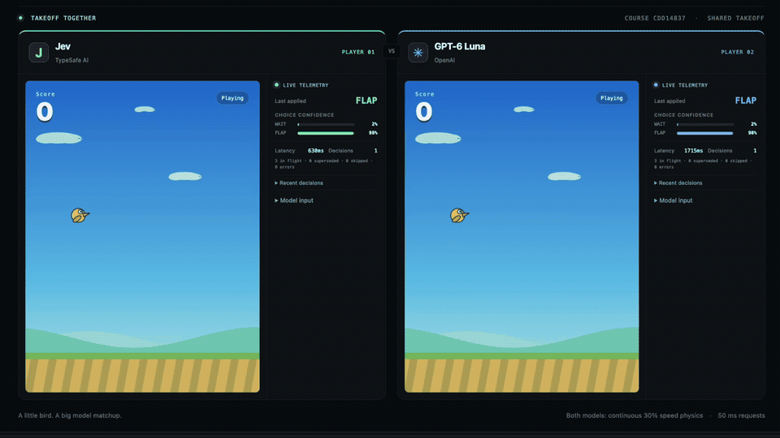

# Flappy Arena 🐦 - two models, one course.

> Jev and GPT-6 Luna race through the same Flappy Bird course.
> Every flap is a live model decision.




Each run starts on a fresh, shared course.
Both birds take off together, then live with their own decisions.
The score, latest action, confidence, and response time stay visible while they fly.

## Run it locally

You need Node.js 22.19 or newer and API keys for [TypeSafe AI](https://typesafe.ai/) and [OpenAI](https://platform.openai.com/).

```bash
git clone https://github.com/jaibhasin/jev-flappy-bird.git
cd jev-flappy-bird
npm install
cp .env.example .env
```

Put your `TYPESAFE_API_KEY` and `OPENAI_API_KEY` in `.env`, then start the server:

```bash
npm start
```

Open [localhost:4173](http://localhost:4173) and click **Start the matchup**.
The keys stay on your local server.

## How the race works

1. A random seed gives both games the same pipe layout and physics.
   The birds launch together after each model has made its first decision.
2. Each model sees its own bird's projected position, velocity, and next pipe, then chooses `flap` or `wait`.
   The projection accounts for expected response time.
3. The games keep moving at 30% speed while requesting decisions every 50 ms.
   Several requests can be in flight at once, and a flap supersedes pending answers based on the old flight path.

If an answer is late or fails, the bird keeps moving under gravity.
The browser shows which answers were applied, superseded, or skipped.

## Inspect a run

The server writes Jev decisions to `jev-logs.jsonl` (latest 50) and GPT-6 Luna decisions to `luna-logs.jsonl`.
Browser timing and game outcomes go to `diagnostics.jsonl`.
These local files are ignored by Git.
You can also read the model logs at [`/api/jev/logs`](http://localhost:4173/api/jev/logs) and [`/api/openai/logs`](http://localhost:4173/api/openai/logs).

Run `npm run check` for the JavaScript syntax checks and game tests.
